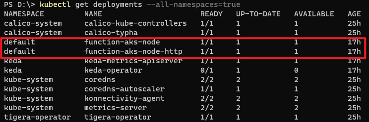
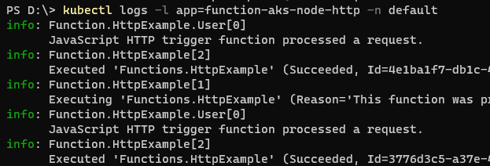
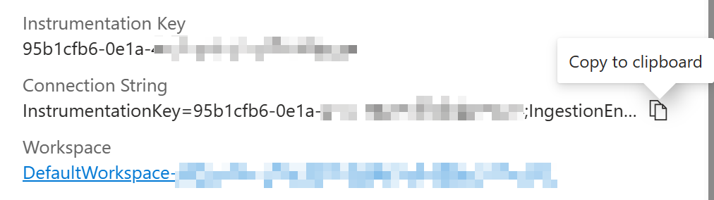
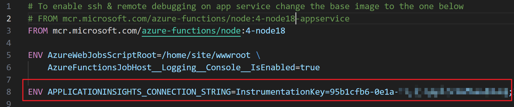
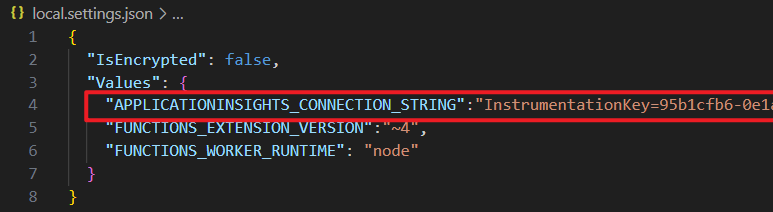
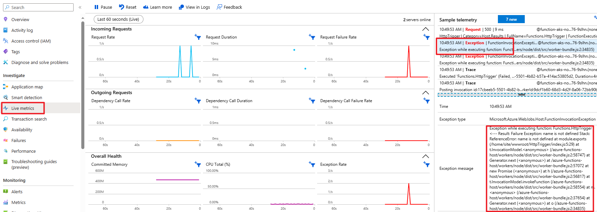

# How to troubleshoot issues with Azure Functions on Kubernetes

Unlike normal Azure Function App, which has embeded logging system and Kudu site to provide telemetry and logs for troubleshooting, those information are not exposed directly in AKS, which makes it harder to troubleshoot. This article will introduce some ways to help troubleshoot issue with Azure Functions on Kubernetes.

## Get Functions Logs from Kubernetes pods

This is the most direct way to get Function Logs, however it only provides the raw data and does not include timestamps. Below are the detailed steps.

### Step 1: Find the deployment of the Functions

Get credentail of the AKS cluster in case you haven't.
```bash
az aks get-credentials --resource-group myResourceGroup --name myAKSCluster
```

Run command below to get all the deployment.
```bash
kubectl get deployments --all-namespaces=true
```

Find the corresponding Functions deployment, record the namespace and app name.



### Step 2: Retrieve the logs

Run command below to retrieve the logs, add "--tail=-1" at the end in case you need all logs since pod start, add "-f" in case you need live logs.

```bash
kubectl logs -l app=appname -n namespace
```




## Get telemetry and logs using Azure Application Insights

Azure Application Insights is a powerful monitoring and diagnostics service offered by Azure that helps developers understand the performance and usage of their applications. It provides rich data about the application, including telemetry, logs, and performance metrics, which can be invaluable when troubleshooting issues in an Azure Function App.

Here's a step-by-step guide on how to leverage Azure Application Insights to troubleshoot issues in your Azure Function App on Kubernetes:

### Prerequisites

Before you start troubleshooting your Azure Function App using Azure Application Insights, make sure you have the following prerequisites:

- An Active Azure subscription and Azure Application insights. If you haven't set up an Azure Application insights, you can follow the [Azure Application Insights Quickstart](https://learn.microsoft.com/en-us/previous-versions/azure/azure-monitor/app/create-new-resource?tabs=net) to create one.

### Step 1: Get connection string for Azure Application Insights

Go to the [Azure portal](https://portal.azure.com) and navigate to your Azure Application Insights. On the right side, copy the connection string for the application insights.



### Step 2: Configure connection string for application insights as environment variable

The environment variable can be defined in either Dockerfile or local.settings.json


#### Option 1: Add a new environment variable "APPLICATIONINSIGHTS_CONNECTION_STRING" with key word ENV



#### Option 2: Add a new environment variable "APPLICATIONINSIGHTS_CONNECTION_STRING" in local.settings.json



### Step 3: Build and deploy using the updated docker image

Deploy to Function on AKS

```bash
func kubernetes deploy --name <repository_name> --registry <your-docker-username>
```

### Step 4: View Telemetry Data

1. Once inside the Application Insights resource, you'll find various sections such as "Overview," "Performance," "Failures," etc.

2. The "Overview" section provides a high-level view of your application's performance and usage. It displays metrics like request rates, response times, and availability.

3. Use the "Performance" section to analyze the performance of your Azure Function App. You can visualize data, set up performance alerts, and examine traces and exceptions.

4. The "Failures" section gives insights into any failures or exceptions that occurred in your Azure Function App. It provides details such as the stack trace, exception message, and affected requests.

5. Explore other sections like "Dependencies," "Live Metrics Stream," and "Logs" to gain deeper insights into the behavior of your Azure Function App. Below screenshot shows a sample for execption in Live Metric Stream.



### Step 5: Diagnose Issues

1. If you notice any unusual behavior in your Azure Function App, start by investigating the relevant sections in Azure Application Insights.

2. Analyze the telemetry data, performance metrics, and logs to identify any patterns or irregularities.

3. Look for exceptions, high response times, or errors in the "Failures" and "Performance" sections.

4. Examine dependencies, such as external services, and check if any failures or delays are causing issues in your Azure Function App.

5. Use the "Live Metrics Stream" to monitor real-time data and quickly identify any anomalies.

### Step 6: Configure Alerts

1. To proactively monitor your Azure Function App, configure alerts based on specific metrics or thresholds.

2. In the "Alerts" section of Azure Application Insights, define alert rules that will trigger notifications (via email, webhook, etc.) when certain conditions are met. For example, you can set up an alert for high CPU usage or excessive response times.

3. Adjust the alert thresholds based on your application's requirements and performance expectations.

### Step 7: Iterate and Improve

1. Once you've identified the root cause of an issue or identified an area for optimization, make the necessary changes to your Azure Function App.

2. Continue monitoring the performance and usage of your application through Azure Application Insights to evaluate the impact of your changes.

3. If new issues arise, repeat the troubleshooting process to diagnose and resolve them effectively.

By following these steps, you can effectively troubleshoot issues in your Azure Function App using Azure Application Insights. Leveraging the rich telemetry, logs, and performance data provided by Azure Application Insights will enable you to quickly identify and resolve potential problems, ensuring the smooth operation of your Azure Function App.