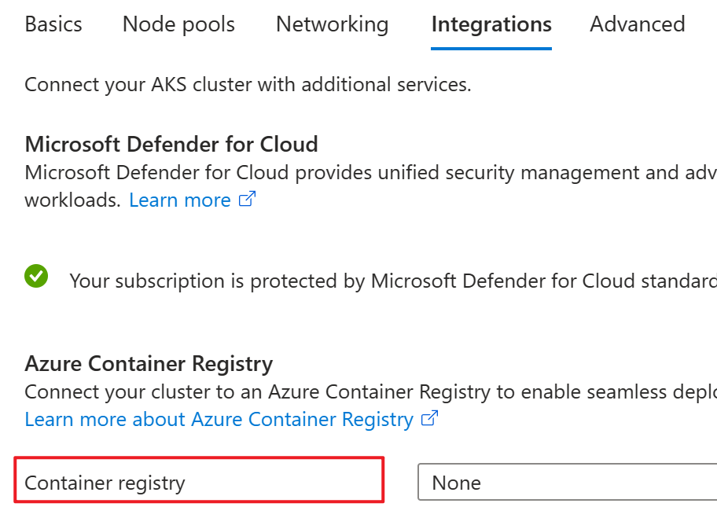

# Quickstart: Create your first Azure Functions on Kubernetes with KEDA

Azure Functions is a serverless compute service that enables you to run event-driven code without having to manage or pay for the underlying infrastructure. Kubernetes is a popular, open source container orchestration system, which can provide a scalable and reliable environment to run cloud-native applications. Kubernetes-based event-driven autoscaling (KEDA) is an open source project that enables Azure Functions to run on Kubernetes natively, with event-driven autoscaling.

In this quickstart, you'll create your first Azure Function on Kubernetes with KEDA, using the Azure Functions Core Tools and the Azure CLI Tools. 

## Prerequisites

To complete this quickstart, you need:

- An Azure account with an active subscription. If you don't have an account, you can [create a free account](https://azure.microsoft.com/free/).
- The Azure Functions Core Tools. For more information, see [Azure Functions Core Tools](https://docs.microsoft.com/azure/azure-functions/functions-run-local?tabs=linux%2Ccsharp%2Cbash).
- The Azure CLI Tools. For more information, see [Azure CLI](https://learn.microsoft.com/en-us/cli/azure/).
- Azure Container Registry or [Docker Hub Account](https://hub.docker.com/) to store your docker image, see [Azure Container Registry documentation](https://learn.microsoft.com/en-us/azure/container-registry/).

## Create a Azure Container Registry

Azure Container Registry (ACR) is a private registry service for building, storing, and managing container images and related artifacts. In this quickstart, you create an Azure container registry instance for stroing docker image. see [Quickstart: Create an Azure container registry using the Azure portal](https://learn.microsoft.com/en-us/azure/container-registry/container-registry-get-started-portal?tabs=azure-cli).

## Create a Kubernetes cluster

Create a Kubernetes cluster using the Azure Kubernetes Service (AKS) or any other Kubernetes platform of your choice. see [Quickstart: Deploy an Azure Kubernetes Service (AKS) cluster using the Azure portal](https://learn.microsoft.com/en-us/azure/aks/learn/quick-kubernetes-deploy-portal?tabs=azure-cli). You need to have the Azure Container Registry integrated during the set up. Such that it will create a managed identity for the AKS to pull image from ACR.


## Create an Azure Function project

Create an Azure Functions project with Dockerfile using the Azure Functions Core Tools:

```bash
func init MyFunctionProj --worker-runtime node --docker
```

This creates a new Azure Functions project called MyFunctionProj, using the node worker runtime. You can replace node with your preferred runtime like python, dotnet.

## Create an Azure Function

Create a new HTTP-triggered Azure Function called `Hello`:

```bash
cd MyFunctionProj
func new --name Hello --template "HTTP trigger" --authlevel "anonymous"
```

This creates a new node script file called `index.js` in the `MyFunctionProj/Hello` directory, which contains boilerplate code for an HTTP-triggered Azure Function.

## (Optional) Set AzureWebJobsStorage.

Add Azure Storage connection information for [AzureWebJobsStorage](https://learn.microsoft.com/en-us/azure/azure-functions/functions-app-settings#azurewebjobsstorage) in *local.settings.json*. This is required for triggers like TimerTrigger, BlobTrigger. You can get the connection string by creating or using an existing storage account. 

```json
    {
        "Values": {       
            "AzureWebJobsStorage": "<Azure Storage connection information>",
            "FUNCTIONS_WORKER_RUNTIME": "node",
        }
    }
```

## Connect to the cluster

Configure kubectl to connect to your Kubernetes cluster using the az aks get-credentials command. The following command downloads credentials and configures the Kubernetes CLI to use them.

```bash
az aks get-credentials --resource-group myResourceGroup --name myAKSCluster
```
## Connect to Azure Container Registry or Docker Hub

# [Azure Container Registry](#tab/acr)

```bash
docker login <azure-container-registry-name>.azurecr.io
```

# [Docker Hub](#tab/dockerhub)

```bash
docker login
```
---

## Deploy the Azure Function

Deploy the Azure Function to the Kubernetes cluster:

# [Azure Container Registry](#tab/acr)

```bash
func kubernetes deploy --name <repository_name> --registry <azure-container-registry-name>.azurecr.io
```

# [Docker Hub](#tab/dockerhub)

```bash
func kubernetes deploy --name <repository_name> --registry <your-docker-username>
```
---

This command builds your project as a custom container and publishes it to a Kubernetes cluster. For more deployment options, see [func-kubernetes-deploy](https://learn.microsoft.com/en-us/azure/azure-functions/functions-core-tools-reference?tabs=v2#func-kubernetes-deploy).

Note that if the repository is protected by secret, include the --pull-secret flag that references the private registry credential when running func kubernetes deploy.

```bash
func kubernetes deploy --name <repository_name> --registry <azure-container-registry-name>.azurecr.io --pull-secret <secret>
```

## Test the Azure Function

Test the Azure Function by sending an HTTP request to its endpoint.

```bash
curl http://<public_ip>/api/Hello?name=<your-name>
```

This sends an HTTP GET request to the Azure Function with a query parameter called `name`. The Azure Function reads this parameter and returns an HTTP response with a personalized greeting.

Congratulations! You have created your first Azure Functions on Kubernetes with KEDA. To learn more, see [Azure Functions on Kubernetes with KEDA](https://docs.microsoft.com/azure/azure-functions/functions-kubernetes-keda/).

## Clean up resources

To clean up your resources, navigate to the resource group where the resources in from portal. Once the resource group is loaded, click on Delete resource group to remove the resource group. Or run below command to delete the resource group.

```bash
az group delete --name <ResourceGroupName> --yes --no-wait
```